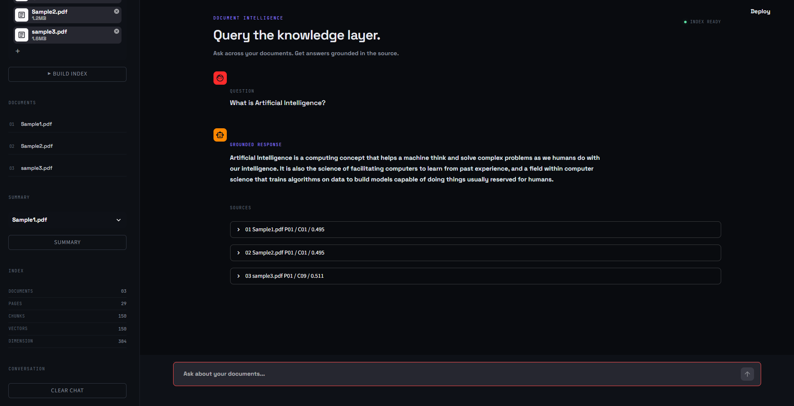
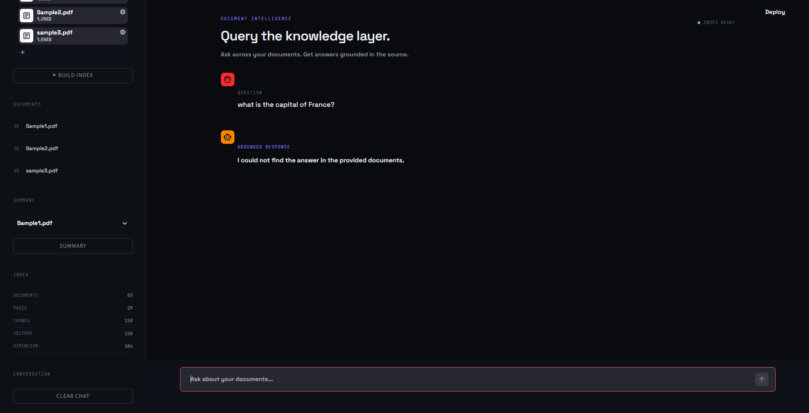
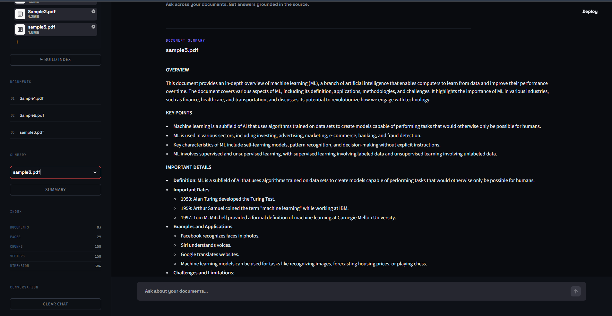

# Multi-Document Retrieval-Augmented Generation (RAG) System

A modular Retrieval-Augmented Generation (RAG) system for querying multiple PDF documents using semantic retrieval, FAISS vector search, LLM-based answer generation, source attribution, document summarization, and NLI-based groundedness evaluation.

The project emphasizes retrieval quality, answer grounding, refusal behavior, and experimental evaluation.

### 🔗 Project Links

- **Live Demo:** https://nexus-rag-zoro.streamlit.app/
- **GitHub Repository:** https://github.com/danish007-Zoro/multi-document-rag
- **Video Demo:** https://youtu.be/oh5gxhl5yTo

## Overview

The system can:

- Load and index multiple PDF documents.
- Extract and clean PDF text.
- Split documents into sentence-aware overlapping chunks.
- Generate dense semantic embeddings.
- Store embeddings in a FAISS vector index.
- Retrieve relevant chunks using semantic similarity.
- Reject queries when relevant evidence cannot be found.
- Generate answers using a Groq-hosted LLM.
- Display source documents, pages, chunks, and retrieval distances.
- Summarize individual documents.
- Evaluate retrieval, generation, and groundedness.
- Test adversarial and out-of-domain queries.
- Run through both a command-line interface and a Streamlit web application.

## Architecture

```text
PDF Documents
      |
      v
Text Extraction
      |
      v
Text Cleaning + Sentence-Aware Chunking
      |
      v
Sentence Embeddings
      |
      v
FAISS Vector Index
      |
      v
Query Embedding
      |
      v
Semantic Retrieval
      |
      v
Top-K Relevant Chunks
      |
      v
Distance Threshold
      |
      +--------------------+
      |                    |
   Relevant             Irrelevant
      |                    |
      v                    v
Context Construction     Refusal
      |
      v
Prompt Construction
      |
      v
Groq LLM
      |
      v
Generated Answer
      |
      v
Answer + Source Attribution
      |
      v
NLI Groundedness Evaluation
```

## Core Components

### Document Processing

PDF documents are extracted, cleaned, and split into retrieval-friendly chunks.

The chunking system:

- Preserves page metadata.
- Uses sentence-aware boundaries.
- Supports overlap between adjacent chunks.
- Handles oversized sentences.
- Detects reference-oriented sections.

### Semantic Embeddings

Document chunks and queries are represented using Sentence Transformers.

Current embedding dimension:

```text
384
```

### FAISS Retrieval

Embeddings are stored in a FAISS index for similarity search.

Current benchmark corpus:

```text
Documents : 3
Pages     : 29
Chunks    : 150
Vectors   : 150
Embedding : 384
```

Current retrieval configuration:

```text
Retrieval Threshold : 1.4
Top-K               : 3
```

If the best available evidence is outside the accepted retrieval range, the system refuses to answer from the provided documents.

### Query Rewriting

The generation layer supports reformulating conversational questions into standalone retrieval queries.

Current model:

```text
llama-3.1-8b-instant
```

Query rewriting:

```text
Temperature : 0
Max tokens  : 100
```

### Answer Generation

Answers are generated using Groq.

Current model:

```text
llama-3.1-8b-instant
```

Generation configuration:

```text
Temperature : 0.1
Max tokens  : 300
```

### Source Attribution

Retrieved evidence is exposed with metadata such as:

```text
Document
Page
Chunk
Distance
Rank
```

This makes retrieval inspectable instead of presenting the generated answer as an unexplained result.

## Groundedness Evaluation

A major component of the project is evaluating whether generated claims are supported by retrieved evidence.

The project includes:

- Similarity-based groundedness experiments.
- Claim-level groundedness evaluation.
- NLI-based groundedness.
- Groundedness threshold experiments.
- Adversarial groundedness testing.
- End-to-end groundedness evaluation.

The final groundedness implementation uses NLI entailment.

Current NLI model:

```text
cross-encoder/nli-deberta-v3-base
```

Claims are evaluated against retrieved evidence using:

```text
entailment
contradiction
neutral
```

## Evaluation Results

### End-to-End Evaluation

The final benchmark contains 22 queries.

```text
Total Queries          : 22
Passed                 : 22
Failed                 : 0
Overall Pass Rate      : 100.00%
Average Fact Coverage  : 100.00%
Relevant Query Rate    : 100.00%
Refusal Accuracy       : 100.00%
```

The benchmark includes both answerable questions and deliberately out-of-domain questions.

Out-of-domain examples include:

- What is the capital of France?
- Who is the Prime Minister of India?
- How do you bake a chocolate cake?
- What is the boiling point of water?
- Who wrote Romeo and Juliet?
- What is the tallest mountain in the world?

The system correctly refused these queries instead of generating answers from outside knowledge.

These results are benchmark-specific and should not be interpreted as universal accuracy.

### Adversarial Groundedness

The adversarial benchmark contains 16 cases designed to test whether the system distinguishes supported claims from contradictory or unsupported claims.

Final results:

```text
True Positives  : 6
True Negatives  : 10
False Positives : 0
False Negatives : 0

Precision : 100.00%
Recall    : 100.00%
F1 Score  : 100.00%
Accuracy  : 100.00%
```

### Top-K Retrieval Experiment

The retrieval benchmark was evaluated at K = 1, 3, 5, and 10.

| K | Document Hit@K | Chunk Hit@K | Document MRR | Chunk MRR |
|---|---:|---:|---:|---:|
| 1 | 93.75% | 100.00% | 0.9375 | 1.0000 |
| 3 | 100.00% | 100.00% | 0.9583 | 1.0000 |
| 5 | 100.00% | 100.00% | 0.9583 | 1.0000 |
| 10 | 100.00% | 100.00% | 0.9583 | 1.0000 |

Increasing K beyond 3 did not improve document retrieval performance on this benchmark. The current RAG configuration therefore uses K = 3.

## Project Structure

```text
RAG/
|
├── app.py
├── requirements.txt
├── README.md
├── .gitignore
|
├── assets/
├── data/
│   ├── Sample1.pdf
│   ├── Sample2.pdf
│   └── Sample3.pdf
|
├── src/
│   ├── chunking.py
│   ├── embeddings.py
│   ├── extract_text.py
│   ├── faiss_index.py
│   ├── retrieval.py
│   ├── prompting.py
│   ├── generation.py
│   ├── summarization.py
│   ├── rag_pipeline.py
│   ├── main.py
│   ├── evaluation.py
│   ├── generation_evaluation.py
│   ├── multi_document_evaluation.py
│   ├── multi_document_generation_evaluation.py
│   ├── groundedness.py
│   ├── nli.py
│   ├── nli_groundedness.py
│   └── test_*.py
|
└── .streamlit/
```

## Installation

### Clone the repository

```bash
git clone https://github.com/danish007-Zoro/multi-document-rag.git
cd multi-document-rag
```

### Create a virtual environment

Windows:

```powershell
python -m venv venv
.\venv\Scripts\Activate.ps1
```

Linux/macOS:

```bash
python3 -m venv venv
source venv/bin/activate
```

### Install dependencies

```bash
pip install -r requirements.txt
```

## Environment Configuration

Create a `.env` file in the project root:

```text
GROQ_API_KEY=your_groq_api_key_here
```

Never commit the real API key. `.env` is excluded by `.gitignore`.

## Running the System

### Command-Line Interface

```bash
python src/main.py
```

Available commands:

```text
ask <question>
summarize <document>
documents
stats
exit
```

### Streamlit Application

```bash
streamlit run app.py
```

The web application provides an interactive interface for asking questions, viewing retrieved sources, uploading documents, viewing document information, and summarizing documents.

## Demo

[▶️ Watch the full demo on YouTube](https://youtu.be/oh5gxhl5yTo)

The demo shows multi-document ingestion, semantic retrieval, grounded answer generation, source attribution, refusal behavior, and document summarization.

## Screenshots

### RAG Answer with Source Attribution

The system generates an answer from retrieved document evidence and exposes the supporting document, page, chunk, and retrieval distance.



### Refusal for Unsupported Queries

When relevant evidence cannot be retrieved from the indexed documents, the system refuses to answer instead of relying on outside knowledge.



### Document Summarization

The system can summarize an individual document directly from the uploaded document collection.



## Running Evaluations

End-to-end:

```bash
python src/test_end_to_end.py
```

Top-K retrieval:

```bash
python src/test_top_k_experiment.py
```

Groundedness:

```bash
python src/test_groundedness.py
```

Adversarial groundedness:

```bash
python src/test_adversarial_groundedness.py
```

NLI groundedness:

```bash
python src/test_nli_groundedness.py
```

Groundedness threshold:

```bash
python src/test_groundedness_threshold.py
```

Chunking experiment:

```bash
python src/test_chunking_experiment.py
```

## Technologies

- Python
- Sentence Transformers
- FAISS
- NumPy
- PyMuPDF
- PyTorch
- Hugging Face Transformers
- Groq
- Streamlit
- python-dotenv

## Design Principles

### Retrieval before generation

The LLM is provided with retrieved document context rather than being treated as the primary source of factual information.

### Explicit refusal

When relevant evidence cannot be retrieved, the system refuses instead of guessing.

### Inspectability

Retrieved sources, page numbers, chunk identifiers, and distances are exposed for analysis.

### Experimental evaluation

Retrieval and generation behavior are evaluated using explicit benchmarks.

### Groundedness verification

Generated claims are checked against retrieved evidence using NLI entailment.

### Modular architecture

Document processing, embeddings, indexing, retrieval, prompting, generation, summarization, and evaluation are separated into individual modules.

## Limitations

The reported metrics are based on the project's current benchmark documents and test cases. They should not be interpreted as evidence that the system achieves 100% accuracy on arbitrary documents or real-world queries.

Known limitations include:

- The current evaluation corpus is relatively small.
- Retrieval quality depends on document quality and chunking.
- Semantic similarity can retrieve superficially related content.
- NLI models can make classification errors.
- LLM-generated answers can still contain unsupported details if the grounding layer is bypassed.
- The system depends on an external Groq API for generation.
- API usage is subject to provider limits and model availability.

## Future Improvements

Potential future improvements include:

- Larger and more diverse evaluation datasets.
- Hybrid lexical + semantic retrieval.
- Reranking retrieved chunks.
- More advanced citation validation.
- Retrieval latency benchmarking.
- Generation latency and token-cost analysis.
- Evaluation across multiple embedding models.
- Evaluation across multiple LLMs.
- Better handling of tables and structured PDF content.
- Persistent vector-store support.
- More robust conversational memory.

## Author

**Danish Pasha**

B.Tech — Artificial Intelligence & Machine Learning

A project focused on Retrieval-Augmented Generation, semantic retrieval, LLM evaluation, and grounded AI systems.
